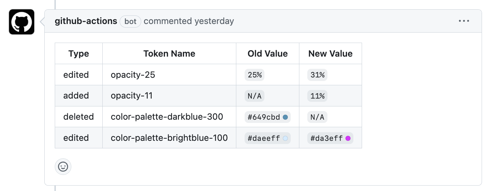

# Design Token Bot

 

A GitHub action that will comment on your design token PRs with an automated changelog.

## Inputs

| name         | required | type   | default         | description |
| ------------ | ---      | ------ | --------------- | ----------- |
| repo-token        | yes      | string |                 | GitHub personal access token used to fetch data. Pass a secret by for instance using `${{ secrets.GITHUB_TOKEN }}`.
| default-branch     | no      | string | `main` | The name of your default branch to compare against
| files       | yes      | string |    | Comma-separated list of globals to check

## Example usage

For now, you'll need to run this against your post transformed tokens, preferably after your entire Style Dictionary build

Workflow:


```yml
name: Design Token Changes

on:
  workflow_dispatch:
  pull_request:

jobs:
  generate_tokens:
    runs-on: ubuntu-latest
    steps:
    - uses: actions/checkout@v3
      with:
        fetch-depth: 0
    - uses: RocketCommunicationsInc/token-bot-action@v0
      with:
        repo-token: ${{ secrets.GITHUB_TOKEN }}
        files: tokens/**/*.json,other/token/file.json
```

## Outputs

This action also outputs a `changes` array containing:

```json
...
{
  "type": "added, removed, or edited",
  "name": "your-token-name",
  "old": "the old value",
  "new": "the new value"
}
...
```

You can use this output to pipe into other Actions. For example, you could take the output and automatically generate a [Changeset](https://github.com/changesets/changesets)


```yml

jobs:
  generate_tokens:
    runs-on: ubuntu-latest
    steps:
    - uses: actions/checkout@v3
      with:
        fetch-depth: 0
    - name: make comments 
      id: comment
      uses: RocketCommunicationsInc/token-bot-action@v0
      with:
        repo-token: ${{ secrets.GITHUB_TOKEN }}
        files: tokens/**/*.json
    - name: Get the changes
      run: echo "heres yer changes ${{steps.comment.outputs.changes}}"

```
